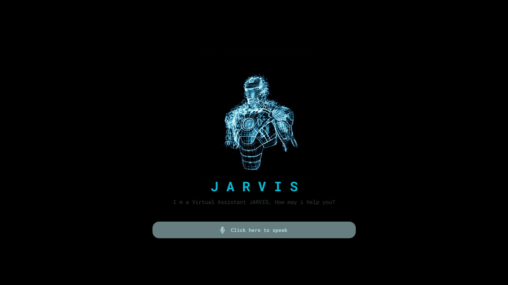

<div align="center">
  
  
  
  
[](https://twitter.com/intent/follow?screen_name=Adnan__Bhaldar)
  <br />
  <br />
  
  

  <h2 align="center">JARVIS - Virtual Assistant</h2>

  JARVIS is a fully responsive Virtual Assistant, <br />Responsive for all devices, built using HTML, CSS, and JavaScript.

   <a href="https://adnan-bhaldar.github.io/JARVIS-Virtual-Assistant/" target="_blank"><strong>➥ Live Demo</strong></a>

</div>

<br />

### Demo Screeshots


### Prerequisites

Before you begin, ensure you have met the following requirements:

* [Git](https://git-scm.com/downloads "Download Git") must be installed on your operating system.

### Run Locally

To run **JARVIS** locally, run this command on your git bash:

Linux and macOS:

```bash
sudo git clone https://github.com/adnan-bhaldar/JARVIS-Virtual-Assistant.git
```

Windows:

```bash
git clone https://github.com/adnan-bhaldar/JARVIS-Virtual-Assistant.git
```

### Contact

If you want to contact with me you can reach me at [Twitter](https://www.twitter.com/Adnan__Bhaldar).

### License

This project is **free to use** and does not contains any license.
